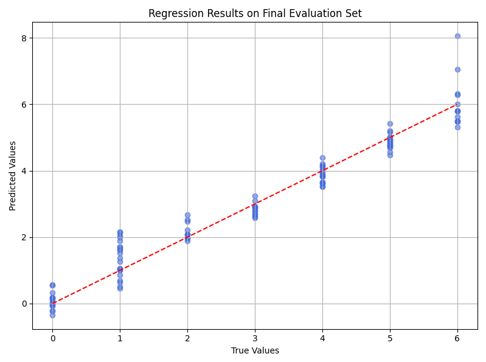
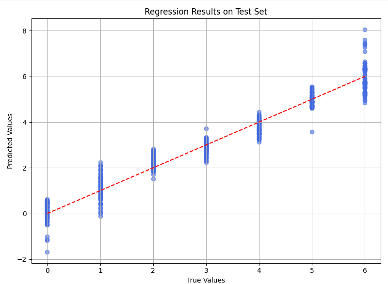

# 🧠 Obesity Prediction Project

This project was developed as part of an Artificial Intelligence university workshop. The goal is to train a machine learning model that predicts an individual's level of obesity based on personal, dietary, and lifestyle features. The project focuses on the full pipeline—from data ingestion and preprocessing to model training, feature impact analysis, and evaluation—using a Linear Regression model.

---

## 🎯 Objective

- Develop a predictive model using **Linear Regression**.
- Analyze how factors, such as high-calorie food consumption frequency, physical activity, and calorie monitoring, influence obesity predictions.
- Demonstrate the complete workflow from data loading to model evaluation.

---

## 📉 Regression Plot: True vs. Predicted Values

This plot compares the true obesity values with the predicted values from the linear regression model on the test dataset.

### 🔍 What does this plot show?
- **X-axis (True Values)**: The actual obesity values from the dataset.
- **Y-axis (Predicted Values)**: The values predicted by the linear regression model.
- **Blue Points**: Each point represents an individual in the test dataset.
- **Red Dashed Line**: The ideal line for perfect prediction (y = x). If the model were perfect, all points would lie exactly on this line.





### ✅ What is interpreted?
- The points closely follow the red line, which is a good sign: it indicates that the model's predictions are very close to the actual values.
- There is some vertical dispersion, especially at the extremes, which is normal. This shows that the model makes larger errors at certain levels of obesity, but these errors are not severe.
- There are no strange patterns such as curves or misaligned groupings, which confirms that linear regression is a reasonable choice for this case.

### 📌 Conclusion
The linear regression model predicts obesity levels with good accuracy, and this performance is clearly visualized in the plot, where most points align well with the ideal diagonal line.


## 📁 Project Structure

```
ObesityPredictionProject/
│
├── data/
│   └── ObesityDataSet.csv         # Original dataset with 2111 records
│
├── src/
│   ├── data_preprocessing.py      # Data loading and preprocessing
│   └── model.py                   # Model training and evaluation
│
├── main.py                        # Main script that runs the entire process
└── README.md                      # Project documentation (this file)
```
---

## ⚙️ Methodology

1. **Data Preprocessing**:
   - **Loading**: Reads the dataset with 2111 entries.
   - **Cleaning**:
     - Numerical columns with missing values are filled using the mean.
     - Any remaining missing data (e.g., categorical values) is filled with 0.
   - **Encoding**: Categorical features are converted using One-Hot Encoding.

2. **Data Splitting**:
   - The dataset is split as follows:
     - **70% for training** (~1477 records)
     - **25% for testing** (~528 records)
     - **5% for final evaluation** (~106 records)
   - Performed using `train_test_split` with a fixed random state.

3. **Model Training**:
   - A **Linear Regression** model from `scikit-learn` is trained using the training dataset.

4. **Model Evaluation**:
   - Evaluated using **Mean Squared Error (MSE)** on both test and evaluation datasets.
   - Model coefficients are analyzed to interpret feature impact.

---

## 📊 Feature Impact Analysis

Once trained, the model’s coefficients provide insight into how each variable affects obesity prediction:

- **Positive coefficients** → feature increases obesity prediction.
- **Negative coefficients** → feature reduces obesity prediction.

### Examples:
- `family_history_with_overweight_yes`: Large positive coefficient — suggests strong influence on obesity.
- `FAF` (Physical Activity Frequency): Negative coefficient — indicates more activity reduces obesity risk.
- `FAVC_yes` (Frequent High-Calorie Food Consumption): Positive — more caloric intake increases predicted obesity level.
- `CH2O` (Water Consumption): Very small coefficient — minimal influence.
- `MTRANS_Walking`: Moderate positive coefficient — interpreted contextually based on transport habits.

This provides clear evidence of how lifestyle and behavioral variables affect obesity outcomes.

---

## ▶️ How to Run the Project

### 1. Install Requirements

   Make sure Python 3.12+ is installed, then run:

   ```bash
   pip install -r requirements.txt
```

### 🛠️ Libraries Used

- pandas  
- numpy  
- scikit-learn  

---

### 2. Execute the Main Script

bash
Copy
Edit
python main.py
This will:

Load and preprocess the data.

Train the regression model.

Evaluate it on test and evaluation datasets.

Output feature importance via regression coefficients.

## ✅ Project Status

✔️ Model training and evaluation working  
❌ Does not make individual predictions yet  

---

## 📌 Notes

This project was developed as part of a university workshop on Artificial Intelligence. The main objective is to demonstrate the process of training and evaluating a predictive model using real-world data.
